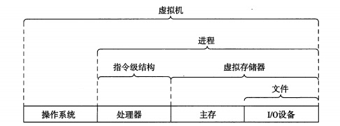
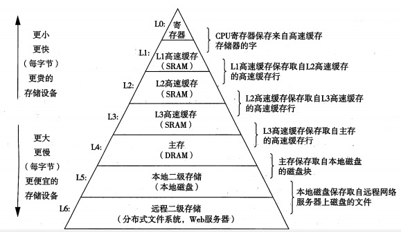

# 计算机系统漫游

## 编译系统

### 步骤

一次编译分为以下步骤：  

>1. 预处理cpp：根据#开头的命令修改和注入代码，处理完的代码一般为“.i”文件。  
2. 编译ccl：将“.i”文件翻译成文本“.s”文件，里面是汇编代码。  
3. 汇编as：将汇编代码翻译成机器语言，保存在“.o”文件中。  
4. 连接ld：将某些预编译好的代码合并到目标程序中，比如标准库中的一些函数，最终得到可执行文件。

### CNU项目

GNU's Not Unix。  
开发出一个完整的类unix系统，内核是linux。包括EMACS、GCC、GDB、汇编器、连接器等等，GCC支持许多种编译型语言。  

## 系统硬件

### 构成

CPU、存储器（磁盘存储器算外设）和外设构成，现代中一般是CPU和存储器中由存储器总线连接，和外设则是IO总线，还有加速计算的GPU等。  

学学HDL，写个简单的CPU可以加深理解，一个简单的CPU的例子，使用Verilog编写：  

[SIMPLE_MIPS_CPU](https://github.com/dtysky/SIMPLE_MIPS_CPU)  

GPU一般由用于计算的ALU（包括加减乘除法器、逻辑运算单元），寄存器堆（特殊的高速存储器，存储特殊数据），控制译码单元（将机器码转译为各个模块的控制信号），指令存储器（存储代码数据），数据存储区（存储数据）以及连接各个模块的数据路径（指令地址计数器PC算一部分）。运行时，PC借由ALU的运算来使自己跳转，而后CPU取出PC指向的指令存储器中的数据作为指令送入控制译码单元，而后调动各模块执行操作。

## 运行开销

比如运行一个简单的打印字符串的程序，加载时，复制到主存（SDRAM），运行时，主存复制到CPU的寄存器堆中，显示时，又复制到显示设备，这些“复制”就是主要开销之一。  

### 高速缓存

高速缓存是为了解决“复制”开销而构造的，它们由SRAM构成，容量介于寄存器堆和主存之间，速度也介于寄存器堆和主存之间。  

一般来讲，会有一个CPU片上的L1缓存，容量高于寄存器堆但访问速度等同于寄存器堆，但速度高于主存两个数量级；L2缓存容量高于L1缓存，速度为L1的五分之一；一些系统拥有L3缓存。  

高速缓存中会存放一些经常会使用到的指令，合理提高cache的命中率将会有效提高性能。（大概现在还有必要？）  

## 操作系统

操作系统隔离了上层应用和底层硬件，它提供两个功能：  

>1. 防止硬件被失控的应用程序滥用。  
2. 向应用程序提供简单一致的机制来控制复杂而多样的硬件设备。

简而言之，OS通过自身高度的复杂度对上层应用提供了简单而良好的抽象，使得程序员不需要关心乱七八糟的兼容问题，使得分工和高效率成为了可能。  

这些抽象基本包括：  

>1. 文件：对IO设备的抽象。
2. 虚拟存储器：对主存和IO设备的抽象。  
3. 进程：对IO设备、主存和CPU的抽象。

### 进程

进程是操作系统对一个正在运行的程序的一种抽象。一个系统可以运行多个进程。  
但本质上，一个CPU在同一个时刻只能执行一个进程，多进程的假象（或者说也并不完全是假象）是通过交叉执行实现的，这种交叉执行的流程如下：  

>1. 正在执行A进程，发现需要切换到B进程。
2. 保存A进程的状态（上下文），将执行控制权转移给B进程，执行B进程。
3. B进程执行一段时间，需要切换到A进程，保存B进程上下文，恢复A进程的上下文。

### 线程

线程是对进程的进一步分割，它们可以是同一进程中的若干执行单元，共享进程的上下文、代码和全局数据，所以一般也比多进程更加高效，也适合多并发场景。  

### 虚拟存储器

虚拟存储器是一种抽象，它使得进程可以认为它们都是在独占地使用主存，即主存对于它们而言都是一致的。  
虚拟存储器提供了一个抽象的**虚拟地址空间**，每一个地址段中存储器的内容都有着严格的定义，它们包括：  

>1. 程序代码和数据：对所有进程，代码从同一固定地址开始，然后是数据。  
2. 堆：代码和数据区后就是运行时的堆，堆是可以动态改变大小的。
3. 共享库：存储库。  
4. 栈：编译器使用它进行函数调用，也是可以动态改变大小的。
5. 内核虚拟存储器：这是OS的一部分，为内核保留。

写几段汇编，调试调试可以加深理解。

### 文件

文件就是二进制序列，在类unix系统中，一切皆为文件，系统所有的输入输出都是抽象成文件读写来实现的。

## 通信

通信通过网络实习，网络也可以被视为一个IO设备。

## 一些重要概念

### 并发和并行

并发只一个系统同时具有多个活动，并行只用并发使得一个系统更快地运行。

#### 线程级并发

在单处理器系统中，并发是通过多个进程的快速切换实现的。  
一个处理器上如果拥有多个带有独立处理单元和高速缓存的处理器，则为多核处理器，它们共享更高层的高速缓存，但相互保持独立。  
超线程，即让一个处理器可以“同时”执行多个线程。要注意的是，这个同时也并非真同时，这种处理器的某些硬件有多个备份，可以在单个周期级别去决定执行哪一个线程，这不同于常规的处理器——它们需要大约20000个时钟周期去做不同线程转换，所以基本可以看做是拥有可以同时执行两个线程的能力。

#### 指令级并行

一个周期可以执行多个指令，这个理论效率可以通过一些不那么疯狂和疯狂、不那么玄学和玄学的技术达到。通常，这些手段包括“流水线”、“分支预测”等。  
“超标量”这个术语指处理器可以比一个周期一个指令的速度更快。  

#### 单指令、多数据并行

允许一条指令产生多个可以并行执行的操作称为“单指令、多数据”，即SIMD并行。比如并行对多对浮点数做加法的特殊指令。  
一般建议用特殊的数据类型来编写需要这些运算的程序，比如在GCC中的向量数据和SIMD优化配置。  