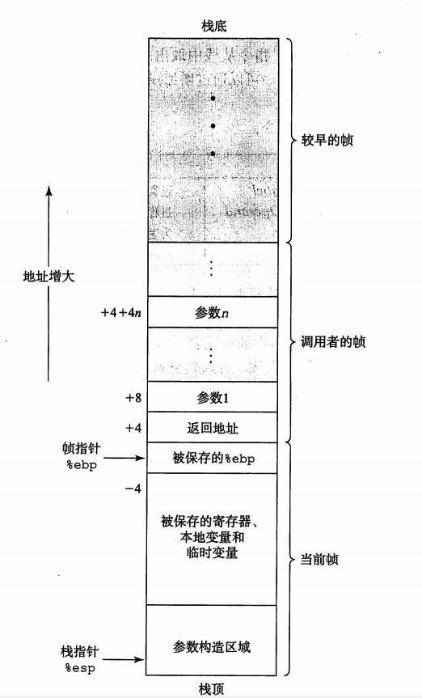

# 2-控制与过程数据存储

## 控制

汇编中使用控制语句来实现线性程序之外的跳转、选择等功能。 

### 条件码

**条件码**用于表示一些CPU最近的状态，它们被存在一个单独的**条件寄存器**中，它们是：  

>CF：进位标志，最近操作发生了进位，可以检查无符号数的溢出。  
ZF：零标志，最近操作结果为0。  
SF：符号标志，最近操作的结果为负数。  
OF：溢出标志，最近操作导致补码溢出。  

要注意的是，`lea`系列指令不会不会改变这些标志，因为它本质上不是ALU运算而是地址运算；`inc`和`dec`会设置溢出标志但不会设置进位标志等......   

还有一些特殊的指令只改变条件码而不发生实际运算，比如`test`、`cmp`，前者对应`sub`、后者对应`and`。  

要访问这些条件码，有一系列的`set d`指令被提供，其中`d`是单字节寄存器，这组指令直接利用条件码去做出一些常用的判断，比如`setge d`相当于给`d`赋予`~(SF ^ OF)`，即前一个运算的两个操作数是否存在大于关系。  

### 跳转

跳转指令`jmp .L`和`jmp *e*`会导致程序在执行时切换到另一个位置。前一种方式中，它的参数`L`是一个**标示符**，这个标示符类似于高级语言中的函数名，用于标示一段程序的开始，汇编中就是用这种方式来管理子程序的；后一种方式中，它的参数`e`是一个寄存器或者以寄存器为地址的`(%eax)`这种存储器的值，这些值将会给当做跳转地址。  
还有一些跳转叫做**条件跳转**，它们是基本跳转语句的特化版本，比如`je`就是当`ZF`位为1时跳转之类的。它们也是高级语言条件语句的基础。  

至于C语言的条件语句翻译成汇编，一般都是先开一个条件跳转语句，然后后面更上else的内容。

### 循环

循环语句在C中有`do-while`、`while`和`for`，太基础就不细说了。  

`do-while`它们可以对应汇编中的`goto`和条件跳转指令的组合，像是：  

    :::asm
    loop:
        xxx
        je next
        goto loop

`while`和`do-while`类似，但它的判断放在loop段的开始，这允许产生零长度的循环：  

    :::asm
    loop:
        je next
        xxx
        goto loop
        

`for`一般等价于`while`形式，是另一种写法。但当和`continue`语句合作是可能有例外。详见习题24。

### 条件传送语句

条件传送语句是现代CPU都有的一条指令，它本质上是以下C代码的翻译：  

    :::c
    int absdiff(int x, int y){
        return x < y ? y - x : x - y;
    }
    
在汇编中，会先计算好`y-x`和`x-y`，然后通过一条`cmovl`指令（`l`表示小于）直接判断前面`cmp`的比较结果即条件码然后送走`y-x`或者`x-y`而不是通过条件跳转。  这样做的效率一般会很高，这是由于CPU内部的流水线采用的分支预测机制。因为对于此指令，处理器只是读数据、检查条件码、然后更新或者不动目的寄存器，不会有额外的跳转。  

当然这个指令并非时时有效，由于它要事先计算两个分支的结果，所以可能会造成无谓的计算浪费，也受编译器的影响。  

### switch指令

对应于C中的switch语句，当分支较多并且每个分支的条件间隔较小时，会生成一个**跳转表**，有个这个表，可以使得分支实现和复杂度无关，相对于经典的条件转移，利用查表的方式可以说复杂度都是固定的，是并行判断。  

## 过程

**过程调用**将数据和控制进行跳转，而后又可以恢复现场继续执行刚才的操作。这是通过**转移到控制**和**转移出控制**实现的。  

### 栈帧

**栈帧**实际上就是栈的一种应用，它是为单个过程所分配的栈，由存放于`%ebp`中的帧指针和存放于`%esp`中的栈指针控制。

  

### 转移控制

当一个过程被`call`指令调用时，首先将返回地址入栈，然后当前一些需要保护的局部变量什么的`入栈`，保护现场，随后跳转到被调用过程 的首地址，调用结束后再使用`leave`指令做好准备，之后`ret`指令恢复现场并返回跳转前的地址继续。 

调用控制中的寄存器分配是约定俗成的`%eax`、`%edx`和`ecx`被分配给被调用者，可以被覆盖，而`%ebx`、`%esi`和`%edi`则分配给调用者，再覆盖之前要先入栈以便恢复。  

对于`递归过程`，编译器会将每次函数对自身的调用都视为调用一个其他的函数，本质上并无区别。

## 数组和结构体

数组是一种聚合数据类型，它在C中实现很简单，为`T A[N]`的形式，这段代码会在内存中分配N个数据类型T需要的内存空间，A作为一个标示符，是一个指向数组开头的指针，而A和下标的组合即可给这个指针加上偏移来访问数组内的任意数据。  

比如定义数组`char A[8]`，首先分配8个字节的内存，然后将A指向这八个字节的开头，`A[4]`则构造`A+4`的指针，可以用其访问数组中的第四个数据。这在汇编中是`movl (%edx, %ecx, 4), %eax`。  

本质上，我们使用`A[i]`相当于先得到元素`A[i]`的引用，然后用`*A[i]`来获得该地址的值。  

### 嵌套数组

即**多维数组**，比如`int A[5][5]`，这和一般数组没什么两样，只不过在计算地址的时候会多一套工序，考虑你是在一个二维矩阵中取值就可以了，比如取值`A[i][j]`，那么地址就是`A + 4(5i + j)`。  

### 定长和变长数组

**定长数组**是指大小在编译期就能就确定的的数组，而**变长数组**则不然，可能会在运行时动态改变。对于前者，尤其是多维的情况下，在编译的时候可以将其地址计算优化为常数乘法，而后者不但不能事先分配内存，必须在需要的时候才动态运算和分配，并且在取值时也要动态使用乘法来计算，所以性能会有所下降。

### 结构

C中的结构`struct`声明创建一个数据类型，将可能不同类型的对象聚合到一个对象，不同的对象用名字来引用。它本质上是方便编程的，因为对于数据本身而言，其在内存上是不变的，结构仅仅是改变去解释他们的方式，每个名字对应一个偏移，而这个偏移用于计算地址，比如：  

    :::c
    struct S{
        int i;
        char c;
        short s;
    }
    
`S`总共占据7个字节，如果其首地址为0，则`S.i`地址为0，`S.c`为4，`S.s`为5。  

由于结构的存在，我们可以非常方便得管理聚合型数据，合理利用它也可以免除数据类型转换、新建内存的开销。  

结构中的对象也可以是指针，这可以用于仿造OOP，比如将指针指向一个函数。  

### 联合

联合`union`和`struct`不同，它用于用不同的类型去解释相同的数据，联合中所有部分的地址偏移都是一致的，它们只是用不同的方式去解释一段数据。比如：  

    :::c
    union U{
        int i;
        char c;
        double d;
    }
    
`U`会占据8字节，即`double`的长度，其中`i`、`c`、`d`的地址偏移都是0。

### 数据对齐

数据对齐对于提高存储器读写性能很关键，原则来讲，如果一个类型占用字节数是`K`，那么其地址应当是`K`的倍数。这就要求`short`类型的地址最低位为0而`int`型为00。对于Windows系统，对齐非常严格按照上述规则执行，而对于unix，8字节只需对齐4字节。  
由于`SSE`指令要求存储器地址是16的倍数，所以栈帧的长度都是16的整数倍。  

## 存储器越界引用和缓冲区溢出

**缓冲区溢出**是一个问题，比如在存储一个字符串时，如果没有分配足够的空间，便会发生溢出。发生溢出时，会错误覆盖栈帧中寄存器的值，这会导致被保存的现场不可恢复、代码无法正确返回等等，可能受到严重的攻击。比如库函数`gets`、`strcpy`等都有这个问题。好一点的方法是使用他们的具有限制最大长度的替代函数`fgets`等。

这种错误常被用于网络攻击，比如给字符串内巧妙加入一些可执行代码的字节编码，然后让其溢出，覆盖返回地址，这样就可以执行攻击代码。  

### 对抗

对抗溢出攻击有几种方式。其中一种是**栈随机化**，它给程序端之前分配一些随机的、不使用的空闲空间，来是的程序的实际地址发生偏移，这样可以让程序字段的地址不可预测，是的攻击程序对地址的把握困难，这可以消除一部分影响。**栈随机化**被扩展后是**地址空间布局随机化**(ASLR)，除了栈之外，全局变量、堆等都要随机化。  

另一种方法是**栈破坏检测**，也就是在栈帧的局部缓冲区与栈状态之间存储一个**哨兵**，被称为**栈保护者**，程序运行中不断检测它，当其被改变，即破坏时便会识别出被入侵。  

还有一种就是**限制可执行区域**，即限定代码可以存储在什么区域。